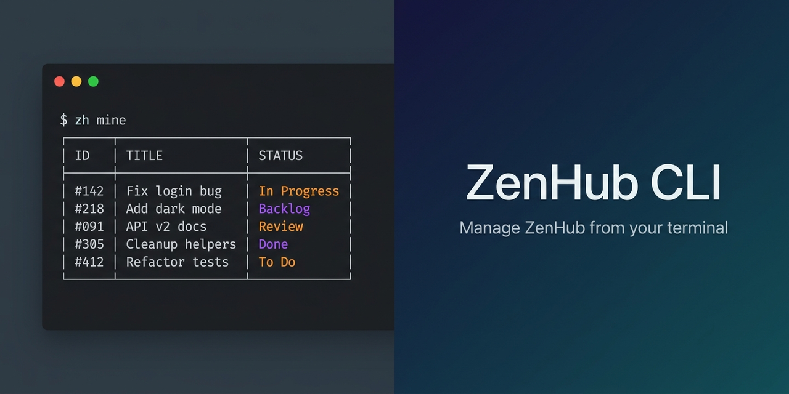

# ZenHub CLI (`zh`)



[](https://opensource.org/licenses/MIT)
[](https://github.com/daniel-pittman/zenhub-cli/releases)
[](https://github.com/daniel-pittman/zenhub-cli/actions/workflows/ci.yml)
[](https://www.python.org/downloads/)

A powerful command-line interface for ZenHub. Manage issues, pipelines, sprints, and more directly from your terminal.

## Features

- 📋 **View & manage issues** - See details, move between pipelines, set estimates
- 🔄 **Sprint planning** - Board overview, pipeline management, bulk operations
- 🎯 **Prioritization** - Reorder issues, set priorities, manage dependencies
- ✨ **Create issues** - Full support for types, labels, assignees, and descriptions
- 🔗 **ZenHub URLs** - Clickable links to issues in the ZenHub board
- 📁 **Multi-repo workspaces** - Works with workspaces containing multiple repositories
- 🤖 **AI-friendly** - Designed for use with AI assistants like Claude
- 🔍 **Duplicate detection** *(MCP only)* - Sentence-embedding similarity search catches paraphrased duplicates before creating issues
- 🤖 **Bundled Claude Code agent** - Drop-in `agents/zenhub.md` adds intelligent behavior layer on top of the tools (propose-first for destructive ops, batch audit trails, proactive duplicate detection)

## Requirements

Before installing, ensure you have these dependencies:

| Dependency | Purpose | Installation |
|------------|---------|--------------|
| **bash** | Shell (v4.0+) | Pre-installed on macOS/Linux |
| **curl** | HTTP requests | Pre-installed on most systems |
| **jq** | JSON processing | `brew install jq` or `apt install jq` |
| **git** | Repository detection | `brew install git` or `apt install git` |
| **gh** | GitHub CLI | `brew install gh` or see [cli.github.com](https://cli.github.com) |

### Verify Dependencies

```bash
# Check all dependencies are installed
command -v bash curl jq git gh >/dev/null && echo "All dependencies installed!" || echo "Missing dependencies"

# Ensure GitHub CLI is authenticated
gh auth status
```

## Installation

### Option 1: Clone and Symlink (Recommended)

```bash
# Clone the repository
git clone https://github.com/daniel-pittman/zenhub-cli.git ~/.zenhub-cli

# Add to your PATH (choose one):

# For bash (~/.bashrc or ~/.bash_profile):
echo 'export PATH="$HOME/.zenhub-cli:$PATH"' >> ~/.bashrc
source ~/.bashrc

# For zsh (~/.zshrc):
echo 'export PATH="$HOME/.zenhub-cli:$PATH"' >> ~/.zshrc
source ~/.zshrc

# Or create a symlink:
sudo ln -sf ~/.zenhub-cli/zh /usr/local/bin/zh
```

### Option 2: Direct Download

```bash
# Download the script
curl -o ~/.local/bin/zh https://raw.githubusercontent.com/daniel-pittman/zenhub-cli/main/zh
chmod +x ~/.local/bin/zh

# Ensure ~/.local/bin is in your PATH
```

### Verify Installation

```bash
zh help
```

## Configuration

### Step 1: Generate API Tokens

You need **two tokens** from ZenHub:

| Token | URL | Used For |
|-------|-----|----------|
| **GraphQL API** | [app.zenhub.com/settings/tokens](https://app.zenhub.com/settings/tokens) | Most commands |
| **REST API** | [app.zenhub.com/dashboard/tokens](https://app.zenhub.com/dashboard/tokens) | `unblock` command |

> **Note:** The GraphQL API doesn't support removing dependencies yet. The REST API token is only needed if you use the `unblock` command. Consider [requesting this feature](https://community.zenhub.com/) from ZenHub.

### Step 2: Create Config File

```bash
mkdir -p ~/.config/zh
cat > ~/.config/zh/config << 'EOF'
ZH_TOKEN=your_graphql_token_here
ZH_REST_TOKEN=your_rest_token_here
EOF

# Secure the file (tokens are sensitive!)
chmod 600 ~/.config/zh/config
```

### Alternative: Project-level Config

You can also create a `.env` file in your project directory:

```bash
# .env (add to .gitignore!)
ZH_TOKEN=your_graphql_token_here
ZH_REST_TOKEN=your_rest_token_here
```

## Commands

| Command | Aliases | Description |
|---------|---------|-------------|
| `issue <number>` | `i`, `show` | View issue details |
| `mine [user]` | `my` | List issues assigned to you (or specified user) |
| `board [--all]` | `b`, `overview` | Show board overview with issue counts |
| `pipeline <name> [--all]` | `pipe`, `col` | List issues in a specific pipeline |
| `pipelines [repo]` | `pipes`, `p` | List pipeline names for a workspace |
| `move <issue> <pipeline>` | `mv`, `m` | Move an issue to a pipeline |
| `reorder <issue> <position>` | `order`, `pos` | Reorder issue within its pipeline |
| `estimate <issue> <points>` | `est`, `points` | Set story point estimate |
| `assign <issue> <user>` | | Assign a user to an issue |
| `unassign <issue> [user]` | | Remove assignee(s) from an issue |
| `comment <issue> [text]` | `c` | Add a comment to an issue |
| `attach <issue>` | | Open issue in browser to add attachments |
| `close <issue> [comment]` | | Close an issue |
| `reopen <issue>` | | Reopen a closed issue |
| `create <title> [options]` | `new` | Create a new issue |
| `block <issue> <blocker>` | `blocked-by`, `depends` | Set issue as blocked by another |
| `unblock <issue> <blocker>` | | Remove a blocking dependency |
| `priority <issue> [level]` | `prio` | Set or view issue priority |
| `epic <subcommand>` | `epics` | Manage ZenHub native epics (see [Epics](#epics)) |
| `subissue <subcommand>` | `subissues`, `sub`, `child`, `children` | Manage sub-issues — 3rd hierarchy tier (see [Sub-issues](#sub-issues)) |
| `types` | | List available issue types |
| `labels` | | List available labels |
| `users` | | List users who can be assigned to issues |
| `workspaces` | `ws` | List available workspaces |
| `help` | `-h`, `--help` | Show help message |

## Usage Examples

### View Issues

```bash
# View details of an issue (includes blocking relationships)
zh issue 42

# See issues assigned to you
zh mine

# See issues assigned to a specific user
zh mine acme-user

# Board overview (open issues only by default)
zh board

# Board overview including closed issues
zh board --all
```

### Browse Pipelines

```bash
# List all pipeline names
zh pipelines

# List issues in a pipeline (open only by default)
zh pipeline "TO DO"
zh pipeline "In Progress"

# Include closed issues
zh pipeline "Done" --all
```

### Move & Prioritize Issues

```bash
# Move issue to a different pipeline
zh move 42 "In Progress"
zh move #42 done          # # prefix and case-insensitive matching

# Reorder within current pipeline
zh reorder 42 top         # Move to top
zh reorder 42 0           # Same as top
zh reorder 42 bottom      # Move to bottom
zh reorder 42 5           # Move to position 5
```

### Estimates & Assignment

```bash
# Set story points
zh estimate 42 3
zh estimate 42 0.5        # Decimals supported
zh estimate 42 clear      # Remove estimate

# Assign users
zh assign 42 username
zh assign 42 @username    # @ prefix works too

# Remove assignees
zh unassign 42 username   # Remove specific user
zh unassign 42            # Remove all assignees
```

### Comments

```bash
# Add inline comment
zh comment 42 "Fixed in PR #99"

# With -m flag
zh comment 42 -m "Still investigating this issue"

# From file (for longer comments)
zh comment 42 -f ./investigation-notes.md

# From stdin (useful for piping)
echo "Automated update: build passed" | zh comment 42 --stdin
```

### Create Issues

```bash
# Simple issue
zh create "Fix login bug"

# With type and labels
zh create "Fix login bug" -t Bug -l "frontend,bug"

# Full options
zh create "Add dark mode" \
  -t Feature \
  -a username \
  -e 5 \
  -p "TO DO" \
  -l "frontend,enhancement"

# With description from file
zh create "Complex feature" -t Feature -f ./description.md

# With description from stdin
cat << 'EOF' | zh create "New feature" -t Feature --stdin
## Description
This feature adds...

## Acceptance Criteria
- [ ] Criterion 1
- [ ] Criterion 2
EOF
```

**Create options:**
- `-t, --type <type>` - Issue type (Bug, Feature, Task, Spike, etc.)
- `-l, --labels <labels>` - Comma-separated labels
- `-a, --assignee <user>` - GitHub username to assign
- `-p, --pipeline <name>` - Pipeline to place issue in
- `-e, --estimate <pts>` - Story points
- `-b, --body <text>` - Short description inline
- `-f, --file <path>` - Read description from file
- `--stdin` - Read description from stdin

### Close & Reopen Issues

```bash
# Close an issue (moves to Closed pipeline in ZenHub)
zh close 42

# Close with a comment
zh close 42 "Completed in PR #99"

# Reopen a closed issue
zh reopen 42
```

### Dependencies & Priority

```bash
# Set issue #123 as blocked by #456
# (Can't work on 123 until 456 is done)
zh block 123 456

# Remove blocking dependency
zh unblock 123 456

# View current priority
zh priority 42

# Set high priority
zh priority 42 high

# Remove priority
zh priority 42 clear
```

### Epics

ZenHub *native* epics (the kind created via the workspace's Epics view, not legacy "epic" labels) are workspace-scoped objects that group related issues. `zh epic` exposes them via subcommands.

The epic numbers shown by `zh epic list` are stable, ZenHub-assigned numeric IDs (the trailing portion of the internal global ID). Re-use them with all other epic subcommands.

```bash
# List all epics in the workspace
zh epic list

# Show an epic and its child issues
zh epic show 12345

# Create a new epic (optionally with description + comma-separated labels)
zh epic create "Auth Service" -d "Build authentication API endpoints" -l backend,auth

# Edit an existing epic's title and/or body (at least one of -t / -d required)
zh epic update 12345 -t "Auth Service (v2)"
zh epic update 12345 -d "Updated body text"
zh epic update 12345 -t "Renamed" -d "New body"

# Add or remove issues from an epic (one OR MORE issue numbers per call)
zh epic add 12345 369 370 412
zh epic remove 12345 369

# Toggle epic state
zh epic close 12345
zh epic reopen 12345

# DANGER: permanently delete an epic (no undo). Prefer `close` unless cleanup
# is intended.
zh epic delete 12345
```

**Epic subcommands:**

| Subcommand | Description |
|------------|-------------|
| `list` | List all epics in the workspace (number, state, title) |
| `show <epic#>` | Show epic metadata, body, and child-issue list |
| `create "Title" [opts]` | Create a new epic. Options: `-d` description, `-l` comma-separated labels |
| `update <epic#> [opts]` | Edit an epic's title and/or body. Options: `-t` new title, `-d` new description. At least one required. Aliases: `edit`, `modify` |
| `add <epic#> <issue#>...` | Add one or more issues to an epic in a single API call |
| `remove <epic#> <issue#>...` | Remove one or more issues from an epic |
| `close <epic#>` | Mark an epic CLOSED |
| `reopen <epic#>` | Mark an epic OPEN |
| `delete <epic#>` | Permanently delete an epic (no undo) |

### Sub-issues

ZenHub supports a 3rd hierarchy tier below Epic → Issue: **sub-issues**. A sub-issue is a regular Issue whose `parentIssue` field points to another Issue. Use this tier when an issue is too big for one ticket but doesn't justify being promoted to a full Epic (e.g., a "Refactor X" parent with one sub-issue per file group).

`zh subissue` exposes the operations as subcommands. Sub-issue numbers are just regular issue numbers — there's nothing special about them in the API surface; only the parent/child relationship is.

```bash
# Link one or more issues as sub-issues of a parent (single API call)
zh subissue add 42 100 101 102

# List a parent's sub-issues (same format as 'zh epic show' children)
zh subissue list 42

# Unlink sub-issues — does NOT close them, just removes the parent relationship
zh subissue remove 42 100

# Reorder a sub-issue among its siblings. Note: sibling-anchored positions,
# NOT integer positions like 'zh reorder' uses.
zh subissue reorder 100 top
zh subissue reorder 100 bottom
zh subissue reorder 100 after 101
zh subissue reorder 100 before 102
```

`zh issue <N>` opportunistically surfaces parent/child info when present:

```
$ zh issue 100

#100 Refactor user-validation helpers

  State:     OPEN
  Pipeline:  In Progress
  ...
  Parent:    #42 Auth Service refactor pass
  Sub-issues: 3 (see 'zh subissue list 100')
  ZenHub:    https://app.zenhub.com/workspaces/.../issues/gh/acme/widget-service/100
  GitHub:    https://github.com/acme/widget-service/issues/100
```

**Sub-issue subcommands:**

| Subcommand | Description |
|------------|-------------|
| `add <parent#> <child#>...` | Link one or more issues as sub-issues of a parent (single API call) |
| `remove <parent#> <child#>...` | Unlink one or more sub-issues from a parent. Aliases: `rm` |
| `list <parent#>` | List a parent's sub-issues. Aliases: `ls` |
| `reorder <child#> <position>` | Reorder a sub-issue among its siblings. Position: `top`, `bottom`, `after <sibling#>`, `before <sibling#>`. Aliases: `order`, `pos` |

**Why sibling-anchored positions and not integers?** ZenHub's `reprioritizeSubIssue` mutation takes `afterId` / `beforeId` cursors (the IDs of sibling issues), not integer positions. The CLI mirrors that semantic directly so its behavior is predictable when called twice in a row — integer positions would silently compute against a moving list.

**Sub-issues vs Epics:** epics are workspace-scoped and visible in the workspace's Epics view; sub-issues are issue-scoped and only visible from their parent. Choose epics for cross-team / multi-sprint groupings; choose sub-issues for tight "one parent ticket, a few worker tickets" relationships.

> **Multi-repo workspaces:** `zh subissue` commands resolve issue numbers via the *current git checkout's* GitHub repo. In a ZenHub workspace that spans multiple GitHub repos, a parent in repo A with sub-issues in repo B can't be managed from a single working directory — each `zh subissue` invocation has to be run from a checkout of the repo whose issue numbers are being passed. The 3-tier framing (Epic → Issue → Sub-issue) often invites cross-repo grouping; plan parent/child placement with that limitation in mind, or do the cross-repo plumbing via the ZenHub web UI. Epic operations have the same scope limitation; sub-issues just feel it more often because the hierarchy is tighter.

### Discovery Commands

```bash
# List available issue types
zh types

# List available labels
zh labels

# List users who can be assigned to issues
zh users

# List workspaces
zh workspaces
```

## Output Options

### ZenHub URLs

By default, `zh mine` and `zh pipeline` show clickable ZenHub URLs for each issue:

```bash
$ zh mine

Issues assigned to acme-user (3):

  #98 │ acme/widget-service │ Product Backlog
    Fix login bug
    → https://app.zenhub.com/workspaces/.../issues/gh/acme/widget-service/98
```

Use `--no-urls` for compact output:

```bash
zh mine --no-urls
zh pipeline "TO DO" --no-urls
```

### Filtering

By default, `board` and `pipeline` commands exclude closed issues to reduce noise:

```bash
zh board              # Open issues only (default)
zh board --all        # All issues including closed

zh pipeline todo      # Open issues only (default)
zh pipeline todo -a   # All issues including closed
```

## Workflows

### Sprint Planning

```bash
# 1. Get the big picture
zh board

# 2. Review backlog
zh pipeline "Product Backlog"

# 3. Move items to sprint
zh move 123 "TO DO"
zh move 456 "TO DO"

# 4. Prioritize the sprint
zh reorder 123 top
zh reorder 456 1

# 5. Set estimates
zh estimate 123 3
zh estimate 456 5

# 6. Assign work
zh assign 123 developer1
zh assign 456 developer2

# 7. Check specific issues
zh issue 123
```

### AI-Assisted Workflows

The CLI is designed for use with AI assistants like Claude, GitHub Copilot, or ChatGPT:

**Ticket Creation:**
```
User: Create a bug ticket for the login issue we discussed

AI: [runs zh labels, zh types to see options]
    [runs zh create "Login fails with special characters" \
          -t Bug -l "bug,frontend" -e 2 -p "TO DO" \
          -b "Users report login failing when password contains & or #"]
```

**Sprint Review:**
```
User: What's in our current sprint?

AI: [runs zh board]
    [runs zh pipeline "TO DO"]
    [runs zh pipeline "In Progress"]

    Summarizes work and blockers
```

**Bulk Operations:**
```
User: Point all the unpointed bugs at 2

AI: [runs zh pipeline "TO DO"]
    [identifies unpointed bugs]
    [runs zh estimate for each]
```

## Troubleshooting

### "Not in a git repository"
The CLI auto-detects your repository from the git remote. Run commands from within a git repository that has a GitHub remote configured.

### "Could not get GitHub repo ID"
Ensure the GitHub CLI is authenticated: `gh auth status`

### "ZenHub API error"
- Check your token is valid and not expired
- Ensure you're using the correct token type (GraphQL vs REST)
- Verify the repository is connected to a ZenHub workspace

### "Issue not found"
The issue must exist in a repository that's part of your ZenHub workspace.

## MCP Server (for Claude Code / AI agents)

A Python MCP server (`mcp_server.py`) ships as a peer to the `zh` bash script. It wraps `zh` over stdio so any [Claude Code](https://docs.claude.com/en/docs/claude-code) session — or any other MCP-aware client — can drive ZenHub backlog operations as native MCP tools without shelling out.

### What it exposes

Roughly 30 tools covering the same surface as `zh`:

| Category | Tools |
|---|---|
| Read | `board`, `pipeline`, `pipelines`, `issue`, `mine`, `epic_list`, `epic_show`, `subissue_list`, `list_users`, `list_labels`, `list_types` |
| Issue lifecycle | `create_issue`, `close_issue`, `reopen_issue`, `move_issue`, `reorder_issue`, `comment`, `assign`, `unassign`, `set_estimate`, `set_priority` |
| Dependencies | `block_issue` |
| Epic management | `epic_create`, `epic_update`, `epic_add_children`, `epic_remove_children`, `epic_close`, `epic_reopen` |
| Sub-issue management | `subissue_add_children`, `subissue_remove_children`, `subissue_reorder` |
| Similarity search | `zh_similar`, `zh_reindex` (see below) |

`epic_delete` is intentionally NOT exposed as an MCP tool — permanent deletion is irreversible and should be invoked via the CLI directly with deliberation.

### Similarity search (duplicate detection)

The MCP server includes a sentence-embedding-backed similarity index that finds existing issues semantically similar to a query — catching paraphrased duplicates that keyword search misses (e.g. *"Auth token refresh race condition under load"* and *"Users randomly logged out around 5pm"* score 0.6 cosine on the same underlying bug despite sharing zero keywords).

**Two tools + a `create_issue` pre-flight:**

- **`zh_similar(query, top_k=5, threshold=0.5)`** — ad-hoc similarity search against open issues. Returns matches with cosine scores.
- **`zh_reindex(full=False)`** — manually refresh the cache. Most callers don't need this; `zh_similar` auto-syncs on a 5-minute TTL.
- **`create_issue` pre-flight** — before creating an issue, the tool runs a similarity check on `title + body`. If any match exceeds the hard threshold (0.70 cosine), the create is **blocked** and the candidate matches are returned. Pass `confirm_create=True` to override after reviewing. Soft matches (0.55-0.70) are surfaced as warnings but don't block.

**How it works:**

1. **Model**: [`sentence-transformers/all-MiniLM-L6-v2`](https://huggingface.co/sentence-transformers/all-MiniLM-L6-v2) — 384-dim embeddings, ~80MB model, runs locally on CPU. Cached at `~/.cache/huggingface/` (persists across reboots).
2. **Cache**: pickled per-repo index at `~/.config/zh/index/<owner_repo>.pkl` (durable). Holds title + body preview + embedding for every open issue.
3. **Sync**: every query auto-checks the cache age. If > 5 min stale, calls `gh api repos/{owner}/{repo}/issues?since=<ISO8601>` to pull only changed issues and re-embeds those. After 7 days untouched, the cache rebuilds from scratch instead of trusting the delta.
4. **First run**: cold start downloads the model (~30s once) and pulls every open issue (~30-60s for a 100-issue backlog). After that, queries are millisecond-level.

**Tuning thresholds**: edit `similarity.py`'s `DUPLICATE_HARD_THRESHOLD` and `DUPLICATE_SOFT_THRESHOLD` constants. Calibration on the original test backlog:
- 0.75+ : identical title with different body → almost certainly a duplicate
- 0.60–0.70 : semantically related but distinct work → surface, don't block
- < 0.55 : just a topic neighbor → ignore

**Disabling**: pass `skip_duplicate_check=True` to `create_issue` to bypass the pre-flight entirely (useful for bulk migrations).

### Installation

```bash
# 1. Make sure zh itself is installed and configured (see Configuration above).

# 2. Register the MCP server with Claude Code (user scope = all sessions on this machine):
claude mcp add --scope user zenhub \
    /usr/bin/python3 \
    /absolute/path/to/zenhub-cli/mcp_server.py

# 3. On first invocation, the server self-bootstraps a venv at /tmp/zhenv
#    and installs the `mcp` package there. /tmp is wiped on reboot, so the
#    server will re-bootstrap automatically next time it's launched.

# 4. Verify:
claude mcp list
# Should show: zenhub: ... - ✓ Connected
```

### How tools resolve the GitHub repo

`zh` detects the GitHub repo from `git config --get remote.origin.url` in its working directory. The MCP server therefore resolves the repo as follows, in priority order:

1. Explicit `repo_path` argument on the tool call (absolute path of a git checkout)
2. `ZH_DEFAULT_REPO_PATH` environment variable
3. The MCP server's own working directory at launch

For multi-project use, the typical pattern is to pass `repo_path` explicitly on each tool call — one MCP server instance can drive multiple ZenHub workspaces, as long as each call points to a different git checkout.

### Environment overrides

| Variable | Purpose |
|---|---|
| `ZH_DEFAULT_REPO_PATH` | Default git checkout directory to run `zh` from when `repo_path` arg is omitted. |
| `ZH_BIN_PATH` | Path to the `zh` bash script (default: peer to `mcp_server.py`). Useful if you want to test against an alternate `zh` build. |

### Requirements

- Python 3.10+ available on PATH (the server probes common locations: PATH default, Homebrew, pyenv shims, system Python).
- All the same requirements as `zh` itself (authenticated `gh` CLI, `ZH_TOKEN` configured, `jq`, `curl`).
- For the similarity-search tools: ~500MB of disk space the first time it runs — `sentence-transformers` installs `torch` + `transformers` into the venv (~400MB) and the embedding model itself caches under `~/.cache/huggingface/` (~80MB).

### Optional: install the bundled `zenhub` agent for delegated use

The MCP server exposes the tools; the bundled **agent** (`agents/zenhub.md` in this repo) is the *behavioral layer* that makes a Claude Code session use those tools intelligently — proactive duplicate detection before drafting, propose-first protocol for destructive ops, batch audit-trail discipline, project-conventions discovery, and the three-option blocked-response framing for `create_issue` near-duplicates.

The bundled `agents/zenhub.md` is a deliberately-generic template — it ships with placeholder examples (`acme/widget-service`, epic `12345`, etc.) and no project-specific filing rules. After copying it to `~/.claude/agents/zenhub.md`, personalize your local copy with your project conventions, sprint patterns, and any non-generic context. **Anything you contribute back to this repo via PR should be genericized first** — local paths, real ticket titles, workspace IDs, and project names belong only in your personal `~/.claude/agents/` copy.

The agent is a single Markdown file with frontmatter. To install:

```bash
# 1. Copy the agent definition into user-scope agents.
mkdir -p ~/.claude/agents
cp agents/zenhub.md ~/.claude/agents/zenhub.md

# 2. Customize the "Project-specific conventions" section near the
#    bottom for your project(s) — filing rules, announcement channel,
#    active epics, sprint conventions. The file ships with a checklist
#    of what to capture per project.

# 3. (No restart needed.) In any Claude Code session on this machine
#    you can now delegate to it:
#
#    "Use the zenhub agent to file a ticket about <X>"
#    "Have the zenhub agent survey the board"
#    "Ask the zenhub agent to propose next sprint's tickets"
```

The agent description tells Claude Code's orchestrator when to delegate to it automatically (e.g. when the user mentions ZenHub ticket operations). You don't have to invoke it by name.

What the agent enforces on top of the raw tools:

| Behavior | Without agent | With agent |
|---|---|---|
| **Duplicate check** | Only fires if you call `zh_similar` manually or if `create_issue` pre-flight catches it | Always runs `zh_similar` *before* drafting; surfaces matches; presents 3-option decision on blocked responses |
| **Destructive ops** | Fired immediately when invoked | Propose-first protocol with what / why / new-state / undo |
| **Batch ops (>5 writes)** | No audit trail unless you build one | Audit-trail YAML required; per-batch announce + spot-check pauses |
| **Project conventions** | Re-discovered each session | Read from project memory or `CLAUDE.md` before any write op |
| **`Closes #N` hazard** | Silent (commit message lands and 10 unrelated tickets auto-close) | Hard rule against this pattern; alternate notations enforced |
| **Filing destination** | Has to be specified per ticket | Defaults from project conventions |

The agent file is genuinely portable — strip the example "Project-specific conventions" section and you have a clean template that works for any ZenHub-using project.

## Contributing

Contributions are welcome! Please feel free to submit a Pull Request.

## License

This project is licensed under the MIT License - see the [LICENSE](LICENSE) file for details.

## Acknowledgments

- Built for use with [ZenHub](https://www.zenhub.com/)
- Inspired by the need for efficient terminal-based project management
- Designed with AI-assisted workflows in mind
